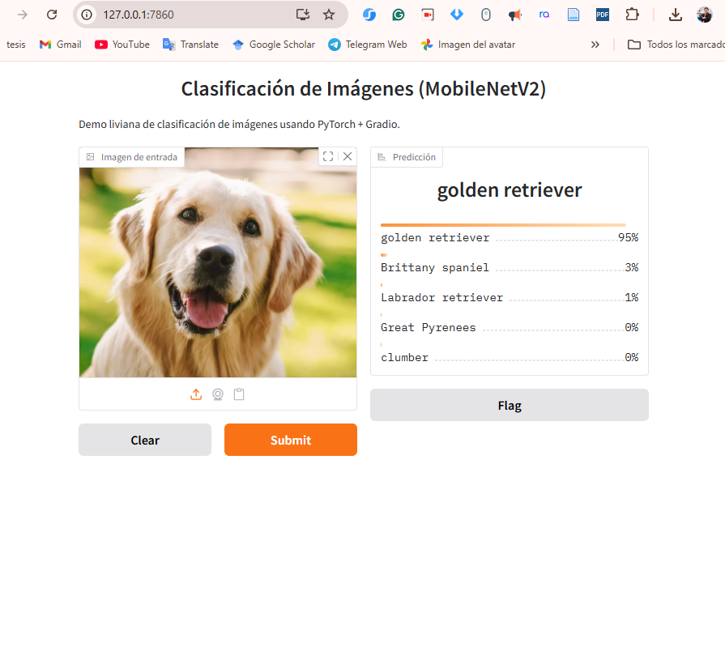

# Tutorial Gradio

Tutorial completo sobre cómo crear interfaces de usuario interactivas con **Gradio**, una librería Python para construir aplicaciones web rápidamente.

Ejemplo de aplicación Gradio:



## Contenido

### 1. `01_UI_simple.py` - Interfaz Simple

**Concepto:** Crear una interfaz básica con `gr.Interface()`

Crea una aplicación simple que:

- Recibe el nombre del usuario como entrada
- Retorna un saludo personalizado

**Componentes utilizados:**

- **Inputs:** `gr.Textbox()`
- **Outputs:** `gr.Textbox()`

**Otros componentes disponibles:**

- Inputs: `gr.Number()`, `gr.Slider()`, `gr.Checkbox()`, `gr.Dropdown()`, `gr.Image()`, `gr.Audio()`
- Outputs: `gr.Label()`, `gr.Image()`, `gr.Audio()`, `gr.JSON()`

---

### 2. `02_UI_blocks.py` - Interfaz con Bloques

**Concepto:** Diseños personalizados con `gr.Blocks()`, `gr.Row()` y `gr.Column()`

Crea una interfaz avanzada que:

- Permite convertir texto a MAYÚSCULAS o minúsculas
- Organiza elementos en filas y columnas
- Vincula múltiples botones a funciones diferentes

**Estructura:**

```
Bloques
├── Row (Fila)
│   ├── Column (Columna 1)
│   │   ├── Input Text
│   │   ├── Button Upper
│   │   ├── Button Lower
│   │   └── Output Label
│   └── Column (Columna 2)
│       ├── Input Text
│       ├── Slider
│       ├── Output Upper
│       └── Output Lower
```

---

### 3. `03_UI_chatBasico.py` - Chat Básico

**Concepto:** Crear un chatbot simple con `gr.Chatbot()`

Crea una interfaz de chat que:

- Recibe mensajes del usuario
- Devuelve respuestas automáticas (efecto de eco)
- Mantiene un historial de conversación
- Limpia la caja de texto después de enviar

**Características:**

- Formato correcto de mensajes: `{"role": "user"/"assistant", "content": "texto"}`
- Botón para enviar mensajes
- Limpieza automática del input

---

### 4. `04_UI_estados.py` - Estado Persistente (Contador)

**Concepto:** Usar `gr.State()` para mantener datos entre llamadas

Crea un contador que:

- Incrementa un número cada vez que se presiona un botón
- Mantiene el estado entre interacciones
- Muestra el valor actual en tiempo real

**Punto clave:**

```python
estado = gr.State(0)  # Inicializar estado
boton.click(fn=incrementar, inputs=estado, outputs=[salida, estado])
```

---

### 5. `05_UI_estados2.py` - Chat con Estado

**Concepto:** Combinar chatbot con estado persistente

Crea un chat mejorado que:

- Usa `gr.State([])` para almacenar el historial
- Responde con formato de echo
- Mantiene todo el historial de conversación
- Usa `msg.submit()` para enviar con Enter

**Diferencia con 03:**

- Usa evento `submit()` en lugar de `click()`
- Historial manejado a través de State
- Mayor flexibilidad para operaciones complejas

---

### 6. `06_UI_Clasificacion1.py` - Clasificación de Imágenes

**Concepto:** Integrar modelos de Deep Learning (PyTorch) con Gradio

Crea un clasificador de imágenes que:

- Carga un modelo preentrenado **MobileNetV2** de PyTorch
- Recibe imágenes como entrada
- Realiza inferencia y devuelve las 5 predicciones principales
- Muestra probabilidades para cada clase

**Componentes:**

- **Input:** `gr.Image(type="pil")` - Recibe imágenes
- **Output:** `gr.Label(num_top_classes=5)` - Muestra top-5 predicciones
- **Modelo:** MobileNetV2 preentrenado en ImageNet

**Flujo:**

1. Cargar etiquetas de ImageNet desde URL
2. Cargar modelo MobileNetV2
3. Procesar imagen (resize, normalización)
4. Realizar predicción
5. Devolver resultados ordenados por probabilidad

---

## Conceptos Clave

| Concepto             | Descripción                        | Ejemplo                                  |
| -------------------- | ----------------------------------- | ---------------------------------------- |
| **Interface**  | Interfaz simple de entrada-salida   | `gr.Interface(fn, inputs, outputs)`    |
| **Blocks**     | Control total sobre el layout       | `with gr.Blocks() as demo:`            |
| **State**      | Memoria persistente entre llamadas  | `gr.State(valor_inicial)`              |
| **Row/Column** | Organización de elementos          | `gr.Row():`, `gr.Column():`          |
| **Events**     | Acciones desencadenadas por usuario | `botón.click()`, `textbox.submit()` |
| **Chatbot**    | Componente especializado para chat  | `gr.Chatbot()`                         |

---

## Instalación

```bash
pip install gradio torch torchvision pillow
```

## Ejecución

```bash
python 01_UI_simple.py
python 02_UI_blocks.py
python 03_UI_chatBasico.py
python 04_UI_estados.py
python 05_UI_estados2.py
python 06_UI_Clasificacion1.py
```

Cada script se lanzará en `http://127.0.0.1:7860`

---

## Progresión de Aprendizaje

1. ✅ Conceptos básicos de Gradio (Interface)
2. ✅ Diseños complejos (Blocks, Row, Column)
3. ✅ Componentes interactivos (Chatbot)
4. ✅ Estado persistente (State)
5. ✅ Manejo avanzado de estado (Chat con State)
6. ✅ Integración de modelos ML (Deep Learning)

---

## Notas Importantes

- **Formato de Chat:** Los mensajes deben ser diccionarios con `role` y `content`
- **State:** Se pasa automáticamente a la función, no necesita estar en inputs
- **Limpieza de Input:** Retornar cadena vacía `""` limpia el textbox
- **Eventos:** `click()` para botones, `submit()` para textbox (Enter)

---

**Autor:** Tutorial Gradio
**Fecha:** 2026
